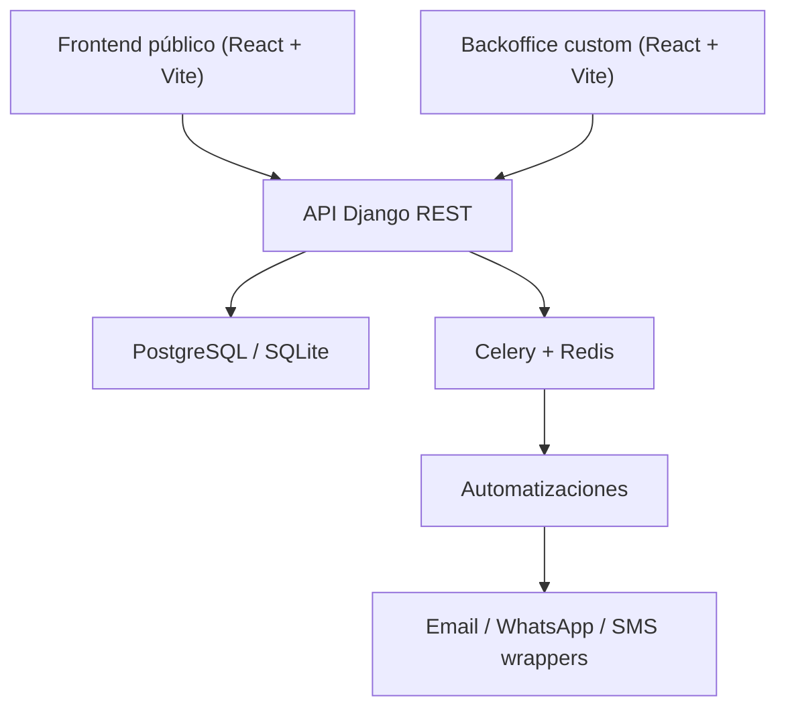
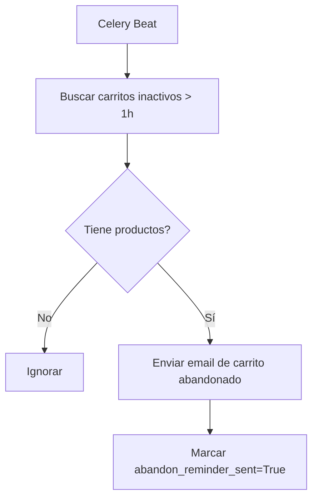
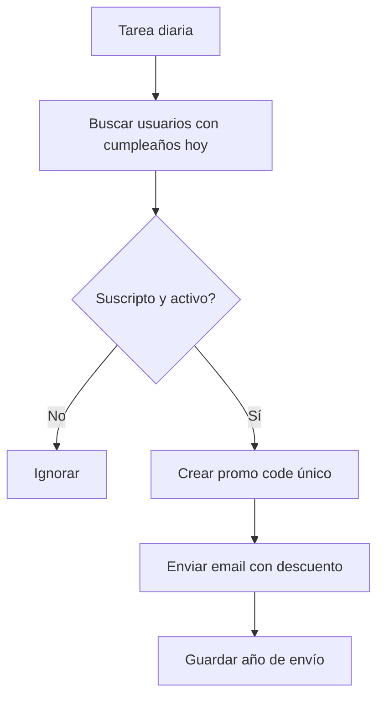

# Bodega La Abeja

Showcase premium de e-commerce vitivinícola y automatizaciones para una bodega de San Rafael, Mendoza.

El proyecto está pensado como portfolio de alto nivel: combina un storefront editorial, un catálogo administrable, un backoffice custom para operación interna y una base backend preparada para crecer hacia checkout, reservas, pagos y automatizaciones más complejas.

## Estado actual

Hoy el repositorio ya incluye un producto navegable y usable para demo:

- storefront público en React con landing, catálogo, ficha de vino, carrito y páginas editoriales
- autenticación JWT con perfil y flujo base de sesión
- backoffice custom para gestionar vinos, categorías y varietales sin depender del Django admin
- backend Django REST con catálogo, auth y API interna para operación
- automatizaciones iniciales de carrito abandonado y descuentos de cumpleaños
- tests y tooling de calidad para backend y frontend

No todo el roadmap original está cerrado todavía.

Lo que ya está implementado:

- catálogo público
- ficha de producto
- carrito visual/persistido
- login JWT
- backoffice custom
- seeds demo
- automatizaciones iniciales

Lo que sigue siendo roadmap:

- checkout real
- órdenes end-to-end
- integración productiva con Mercado Pago
- reservas completas
- workers y servicios externos operando en producción

## Stack

### Backend

- Python 3.12
- Django
- Django REST Framework
- Simple JWT
- django-filter
- structlog
- Celery
- Redis

### Frontend

- React 18
- TypeScript strict
- Vite
- Tailwind CSS
- React Query
- Zustand
- Framer Motion

### Calidad y DX

- pytest
- Vitest
- ESLint
- Ruff
- mypy
- Docker Compose
- GitHub Actions

## Experiencia del producto

### Storefront público

Rutas principales disponibles:

- `/`
- `/vinos`
- `/vinos/:slug`
- `/carrito`
- `/visitas`
- `/historia`
- `/regalos`
- `/guia-de-compra`
- `/contacto`

Incluye:

- landing con narrativa de marca
- catálogo filtrable
- cards de vino con precio, stock, imagen y badges
- ficha detallada con notas de cata, premios y contenido editorial
- carrito persistido en frontend
- navegación y layout de marca consistentes

### Backoffice custom

Ruta principal:

- `/backoffice/login`

Módulos disponibles hoy:

- dashboard operativo
- gestión de vinos
- gestión de categorías
- gestión de varietales

Objetivo del backoffice:

- que alguien comercial, de marketing o de operaciones pueda editar el catálogo sin entrar al Django admin
- priorizar una UX clara para tareas de negocio: precios, stock, imágenes, destacados y contenido de producto

## Arquitectura



## Backoffice custom

El backoffice custom consume una API interna separada del catálogo público.

### Endpoints internos disponibles

- `GET /api/v1/backoffice/dashboard/`
- `GET /api/v1/backoffice/categories/`
- `POST /api/v1/backoffice/categories/`
- `GET /api/v1/backoffice/categories/<id>/`
- `PATCH /api/v1/backoffice/categories/<id>/`
- `DELETE /api/v1/backoffice/categories/<id>/`
- `GET /api/v1/backoffice/varietals/`
- `POST /api/v1/backoffice/varietals/`
- `GET /api/v1/backoffice/varietals/<id>/`
- `PATCH /api/v1/backoffice/varietals/<id>/`
- `DELETE /api/v1/backoffice/varietals/<id>/`
- `GET /api/v1/backoffice/wines/`
- `POST /api/v1/backoffice/wines/`
- `GET /api/v1/backoffice/wines/<uuid>/`
- `PATCH /api/v1/backoffice/wines/<uuid>/`
- `DELETE /api/v1/backoffice/wines/<uuid>/`

### Qué puede hacer hoy

- crear vinos
- editar nombre, slug, SKU, precios y stock
- cambiar estado publicado/destacado/edición limitada
- gestionar imágenes por URL
- editar maridajes, notas, premios y metadata SEO
- crear y ordenar categorías
- crear varietales
- ver KPIs básicos del catálogo

### Seguridad

- autenticación JWT
- acceso restringido a usuarios `staff`
- validaciones server-side con DRF
- logging estructurado con `structlog`

## API pública disponible

### Auth

- `POST /api/v1/auth/register/`
- `POST /api/v1/auth/login/`
- `POST /api/v1/auth/logout/`
- `POST /api/v1/auth/token/refresh/`
- `POST /api/v1/auth/password/reset/`
- `POST /api/v1/auth/password/reset/confirm/`
- `POST /api/v1/auth/password/change/`
- `GET /api/v1/auth/profile/`
- `PATCH /api/v1/auth/profile/`

### Catálogo

- `GET /api/v1/catalog/wines/`
- `GET /api/v1/catalog/wines/featured/`
- `GET /api/v1/catalog/wines/<slug>/`
- `GET /api/v1/catalog/wines/<slug>/reviews/`
- `POST /api/v1/catalog/wines/<slug>/reviews/`
- `GET /api/v1/catalog/categories/`
- `GET /api/v1/catalog/varietals/`

### Salud de la app

- `GET /health/`

## Automatizaciones implementadas hoy

### Carrito abandonado

Busca carritos inactivos por más de una hora y envía un email de recuperación si tienen productos y todavía no fueron marcados como recordados.



### Descuento de cumpleaños

Busca usuarios suscriptos que cumplen años ese día, crea un código único y dispara un email con beneficio.



## Estructura del repositorio

```text
bodega-la-abeja/
├── backend/
│   ├── apps/
│   │   ├── authentication/
│   │   ├── automations/
│   │   ├── catalog/
│   │   ├── notifications/
│   │   ├── orders/
│   │   ├── payments/
│   │   └── reservations/
│   ├── config/
│   ├── management/
│   └── requirements/
├── frontend/
│   ├── public/
│   ├── src/
│   │   ├── api/
│   │   ├── components/
│   │   ├── hooks/
│   │   ├── lib/
│   │   ├── pages/
│   │   ├── store/
│   │   └── types/
│   └── tests/
├── .github/
├── docker-compose.yml
├── Makefile
└── .env.example
```

## Cómo levantarlo sin Docker

### 1. Clonar y preparar variables de entorno

```bash
cp .env.example .env
```

Variables importantes para la demo:

- `DEMO_ADMIN_EMAIL`
- `DEMO_ADMIN_PASSWORD`
- `DATABASE_URL`
- `FRONTEND_URL`
- `BACKEND_URL`

### 2. Backend

Desde la raíz del repo:

```bash
.venv/bin/pip install -r backend/requirements/development.txt
cd backend
../.venv/bin/python manage.py migrate
../.venv/bin/python manage.py seed_demo_data
../.venv/bin/python manage.py runserver 127.0.0.1:8000
```

### 3. Frontend

En otra terminal:

```bash
cd frontend
npm install
npm run dev -- --host 127.0.0.1 --port 3000
```

### 4. URLs locales

- storefront: [http://127.0.0.1:3000](http://127.0.0.1:3000)
- backoffice: [http://127.0.0.1:3000/backoffice/login](http://127.0.0.1:3000/backoffice/login)
- backend API: [http://127.0.0.1:8000](http://127.0.0.1:8000)
- healthcheck: [http://127.0.0.1:8000/health/](http://127.0.0.1:8000/health/)

## Cómo levantarlo con Docker

```bash
cp .env.example .env
make dev
make migrate
make seed
```

## Acceso demo

Si corrés `seed_demo_data` con las variables por defecto de [`.env.example`](/Users/braulio/La-Abeja/.env.example), el acceso demo queda así:

- email: `admin@bodegalaabeja.com.ar`
- contraseña: `LaAbejaAdmin2026!`

Importante:

- estas credenciales son sólo para desarrollo y demo
- en un entorno real conviene reemplazarlas por usuarios creados manualmente o por variables privadas

## Testing y calidad

### Backend

```bash
PYTHONPATH=backend .venv/bin/ruff check backend
PYTHONPATH=backend .venv/bin/mypy backend --config-file backend/pyproject.toml
DJANGO_SETTINGS_MODULE=config.settings.testing PYTHONPATH=backend .venv/bin/pytest backend -q
```

### Frontend

```bash
cd frontend
npm run typecheck
npm run lint
npm run test -- --run
```

## Decisiones técnicas relevantes

- TypeScript en modo estricto para el frontend
- DRF con serializers tipados y separación clara entre catálogo público y backoffice
- Zustand persistido para sesión y carrito
- React Query para sincronización de datos
- `structlog` para logging estructurado
- Celery para automatizaciones desacopladas
- seed demo reproducible para portfolio y ventas

## Qué mostrar en una demo comercial

Si querés presentar este proyecto a una bodega, el recorrido recomendado hoy es:

1. landing pública y narrativa de marca
2. catálogo filtrable
3. ficha de vino
4. carrito
5. login al backoffice
6. edición de un vino en vivo
7. dashboard y gestión de categorías/varietales
8. explicación de automatizaciones ya preparadas

## Limitaciones actuales

- el carrito todavía no cierra una compra real
- el checkout no está conectado a pagos reales
- las imágenes del backoffice se cargan por URL, no por uploader propio
- reservas, pagos y órdenes todavía no están cerrados end-to-end
- el Django admin sigue existiendo como herramienta técnica, pero el flujo pensado para negocio es el backoffice custom

## Roadmap sugerido

### Fase 1

- checkout real
- creación de órdenes
- estado de pedidos
- integración con Mercado Pago

### Fase 2

- panel de pedidos dentro del backoffice
- carga de imágenes por uploader
- gestión de promociones
- acciones masivas sobre catálogo

### Fase 3

- reservas completas
- dashboards de automatizaciones
- métricas comerciales
- deploy productivo con workers y servicios externos

## Licencia y uso

Proyecto creado como portfolio / showcase técnico. Antes de usarlo en producción conviene completar:

- checkout y pagos reales
- observabilidad
- hardening de seguridad
- flujo operativo de órdenes
- despliegue y backups
