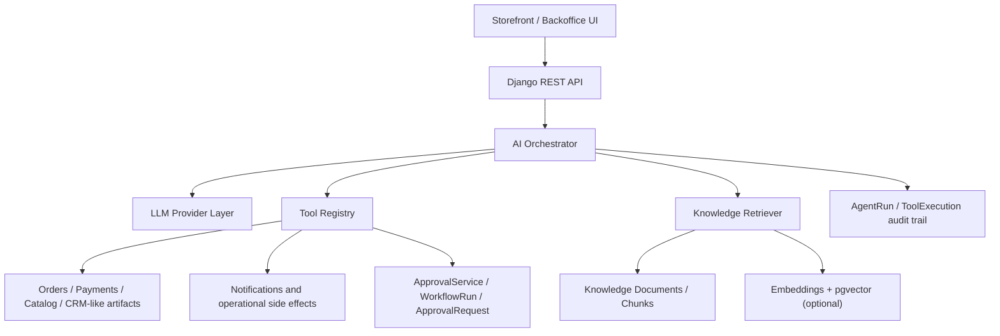
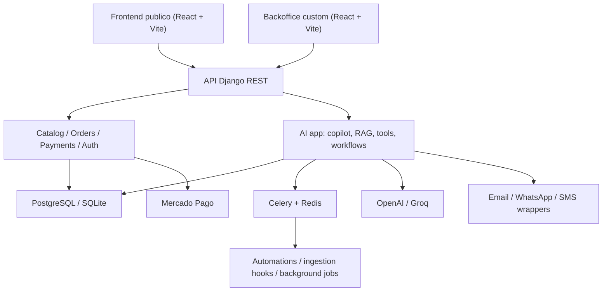
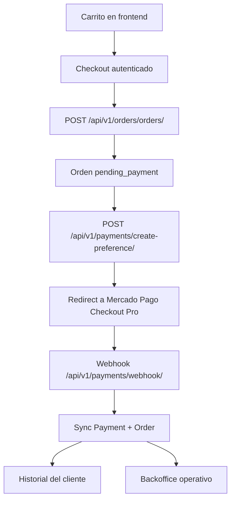

# Bodega La Abeja

E-commerce vitivinicola + backoffice AI-first para una bodega de San Rafael, Mendoza.

Este proyecto ya no es solo un storefront con carrito y CRUD de catalogo. Evoluciono hacia una arquitectura de agente operativo con RAG, tool-calling, aprobaciones humanas, auditoria de ejecuciones, workflows internos y una UI de copilot para operaciones comerciales.

Si despues queres reutilizar este README para actualizar un CV o pedirle a otro modelo que te ayude a redactarlo, el angulo correcto es este:

- producto real con dominio de negocio concreto
- capa AI conectada a entidades vivas del negocio
- RAG con ingestion, chunking, embeddings y retrieval hibrido
- agent runtime con tools, approvals, audit trail y evals
- integracion entre backend AI, backoffice operativo y workflows de negocio

## Resumen ejecutivo

La base del sistema combina:

- storefront premium en React con catalogo, landing editorial, fichas de vino, carrito y checkout fase 1
- backend Django REST para auth, catalogo, ordenes, pagos, automatizaciones y operaciones internas
- backoffice custom para equipos de negocio, marketing y operaciones
- capa AI que actua como support agent y operations copilot usando conocimiento recuperado, tools contra datos reales y guardrails para acciones riesgosas

## Lo mas valioso del proyecto hoy

- checkout real fase 1 con creacion de ordenes y Mercado Pago Checkout Pro
- webhook de pagos y sincronizacion de `Payment` + `Order`
- historial de pedidos del cliente
- backoffice custom para catalogo y pedidos
- copilot interno con tools sobre pedidos, catalogo, pagos, metricas y notas internas
- base de conocimiento con documentos publicos e internos
- retrieval lexico + semantico con fallback elegante cuando embeddings no estan disponibles
- aprobaciones humanas para writes riesgosos
- trazabilidad de runs, tools y workflows
- evals deterministicas para regresiones del agente

## Capa AI-first

La capa AI del proyecto esta pensada como una implementacion seria de producto, no como un chat aislado.

### 1. Runtime de agente

El backend incluye una app dedicada `backend/apps/ai/` con:

- `AIOrchestrator` para persistir turnos, detectar intent, invocar tools y consolidar la respuesta final
- `ToolCallingAgent` para ejecutar un loop de tools con proveedor configurable
- `LLMProviderFactory` y providers OpenAI-compatible para desacoplar proveedor, modelo y transporte
- `ResponseBuilder` y prompts separados para soporte y operaciones

Esto permite alternar entre proveedores como OpenAI y Groq sin reescribir la logica del agente.

### 2. Tool-calling conectado al negocio

La app AI no opera sobre mocks. Ejecuta tools sobre entidades reales del dominio:

- catalogo
- ordenes
- pagos
- stock
- notas internas
- leads
- tareas operativas
- reservas de stock
- metricas comerciales
- comunicaciones por email / WhatsApp

Ejemplos de capacidades ya implementadas:

- buscar pedidos por numero, cliente, telefono o fecha
- inspeccionar incidencias de pago
- listar stock bajo
- consultar ventas por periodo o por varietal
- crear tareas internas de seguimiento
- crear leads a partir de conversaciones
- generar updates de envio
- preparar cambios de estado de pedidos
- escalar conversaciones a humanos

### 3. Human-in-the-loop y aprobaciones

Las acciones con side effects relevantes no se ejecutan ciegamente.

El sistema modela:

- `ToolExecution` con `risk_level`, `status`, payloads y latencia
- `ApprovalRequest` para aprobaciones pendientes
- `WorkflowRun` para trackear la ejecucion completa del flujo
- `AgentRun.needs_human` para marcar corridas que requieren intervencion

Eso habilita un flujo claro:

1. el agente entiende la intencion
2. decide si necesita tool
3. si el tool es riesgoso, deja la accion bloqueada
4. un operador aprueba o rechaza
5. el workflow queda auditado end-to-end

### 4. RAG y base de conocimiento

La app AI implementa un pipeline propio de conocimiento:

- `KnowledgeSource`
- `KnowledgeDocument`
- `KnowledgeChunk`
- `KnowledgeIngestionService`
- `KnowledgeRetriever`
- `VectorStore`

Capacidades reales:

- ingestion idempotente por `source + external_id`
- chunking de documentos
- embeddings para cada chunk
- canales `public` e `internal`
- retrieval lexico
- retrieval semantico opcional con `pgvector`
- fusion de resultados lexico + semantico
- citas por chunk/documento en las respuestas

Comportamiento importante:

- si hay embeddings y `pgvector`, el retrieval suma busqueda semantica
- si no hay embeddings remotos o no hay `pgvector`, el sistema sigue funcionando con busqueda lexica
- el soporte al cliente consulta conocimiento publico
- el copilot interno puede consultar conocimiento interno tambien

### 5. Observabilidad del agente

Cada corrida deja evidencia estructurada:

- texto del mensaje
- intent detectado
- modelo utilizado
- confidence
- citas
- metadata de ejecucion
- tools ejecutadas
- tools bloqueadas
- errores
- timestamps

Eso es muy valioso para:

- debugging
- evaluacion de prompts
- incident review
- explainability operativa
- evolucion del producto AI con feedback real

### 6. Evals deterministicas

No se depende solo de "probar a mano".

El proyecto incluye:

- `EvalRunner`
- comando `run_ai_evals`
- casos deterministas para grounding, order lookup, low stock, ventas y approvals

Esto es exactamente el tipo de capa que suele esperarse en equipos AI Engineer maduros:

- regression testing del agente
- chequeo de intents
- chequeo de tools esperadas
- chequeo de citas
- chequeo de flags como `needs_human`

## Arquitectura AI



## Arquitectura general



## Superficies del producto

### Storefront publico

Rutas principales:

- `/`
- `/vinos`
- `/vinos/:slug`
- `/carrito`
- `/checkout`
- `/checkout/resultado`
- `/pedidos`
- `/pedidos/:id`
- `/visitas`
- `/historia`
- `/regalos`
- `/guia-de-compra`
- `/contacto`

Incluye:

- landing editorial y narrativa de marca
- catalogo filtrable
- fichas de vino con notas de cata, premios y contenido
- carrito persistido
- checkout autenticado
- historial y detalle de pedidos

### Backoffice custom

Ruta principal:

- `/backoffice/login`

Modulos visibles hoy:

- dashboard operativo
- gestion de vinos
- gestion de categorias
- gestion de varietales
- cola de pedidos
- copilot de operaciones
- tareas AI
- leads AI
- approvals AI

## Stack

### Backend

- Python 3.12
- Django
- Django REST Framework
- Simple JWT
- django-filter
- Celery
- Redis
- structlog

### Frontend

- React 18
- TypeScript strict
- Vite
- Tailwind CSS
- React Query
- Zustand
- Framer Motion

### Capa AI

- abstraccion multi-provider para LLMs OpenAI-compatible
- OpenAI y Groq como proveedores conversacionales
- RAG propio sobre tablas Django
- embeddings remotos
- `pgvector` opcional para retrieval semantico
- tool-calling local
- approval gates
- eval runner determinista

### Calidad y DX

- pytest
- Vitest
- ESLint
- Ruff
- mypy
- Docker Compose
- GitHub Actions

## Endpoints AI

La API AI ya expone una superficie bastante completa.

### Chat y copilot

- `POST /api/v1/ai/chat/sessions/`
- `GET /api/v1/ai/chat/sessions/<uuid>/`
- `POST /api/v1/ai/chat/sessions/<uuid>/messages/`
- `GET /api/v1/ai/chat/sessions/<uuid>/events/`
- `POST /api/v1/ai/chat/sessions/<uuid>/feedback/`
- `POST /api/v1/ai/copilot/messages/`
- `GET /api/v1/ai/copilot/overview/`

### Auditoria de runs

- `GET /api/v1/ai/runs/<uuid>/`
- `GET /api/v1/ai/runs/<uuid>/steps/`

### Artefactos operativos creados por AI

- `GET /api/v1/ai/tasks/`
- `PATCH /api/v1/ai/tasks/<uuid>/`
- `GET /api/v1/ai/leads/`
- `PATCH /api/v1/ai/leads/<uuid>/`
- `GET /api/v1/ai/approvals/`
- `POST /api/v1/ai/approvals/<uuid>/approve/`
- `POST /api/v1/ai/approvals/<uuid>/reject/`

### Knowledge ops

- `GET /api/v1/ai/knowledge/sources/`
- `POST /api/v1/ai/knowledge/sources/`
- `POST /api/v1/ai/knowledge/sources/<id>/sync/`
- `GET /api/v1/ai/knowledge/documents/`
- `POST /api/v1/ai/knowledge/reindex/`

### Workflows y metricas

- `POST /api/v1/ai/workflows/lead-triage/run/`
- `POST /api/v1/ai/workflows/order-exception/run/`
- `POST /api/v1/ai/workflows/abandoned-cart/run/`
- `GET /api/v1/ai/workflows/runs/<uuid>/`
- `GET /api/v1/ai/metrics/summary/`

## Checkout fase 1

La fase 1 del checkout ya esta implementada y es demostrable:

- checkout autenticado
- creacion real de orden en backend
- generacion de preferencia en Mercado Pago Checkout Pro
- recepcion de webhook
- sincronizacion de estado de `Payment` y `Order`
- detalle e historial para cliente
- visibilidad operativa en backoffice

Flujo:



## Automatizaciones

### Carrito abandonado

- busca carritos inactivos
- verifica que tengan productos
- envia email de recuperacion
- marca el recordatorio como enviado

### Cumpleanos / promo

- busca usuarios suscriptos con cumple ese dia
- genera promo code unico
- dispara email con beneficio

## Estructura del repositorio

```text
bodega-la-abeja/
├── backend/
│   ├── apps/
│   │   ├── ai/
│   │   ├── authentication/
│   │   ├── automations/
│   │   ├── catalog/
│   │   ├── notifications/
│   │   ├── orders/
│   │   ├── payments/
│   │   └── reservations/
│   ├── config/
│   ├── management/
│   └── requirements/
├── frontend/
│   ├── public/
│   ├── src/
│   │   ├── api/
│   │   ├── components/
│   │   ├── hooks/
│   │   ├── lib/
│   │   ├── pages/
│   │   ├── store/
│   │   └── types/
│   └── tests/
├── .github/
├── docker-compose.yml
├── Makefile
└── .env.example
```

## Como levantarlo sin Docker

### 1. Variables de entorno

```bash
cp .env.example .env
```

Variables importantes para demo base:

- `DEMO_ADMIN_EMAIL`
- `DEMO_ADMIN_PASSWORD`
- `DATABASE_URL`
- `FRONTEND_URL`
- `BACKEND_URL`

### 2. Providers LLM

El runtime conversacional ya acepta aliases utiles para OpenAI y Groq.

#### OpenAI

```bash
AI_LLM_PROVIDER=openai
OPENAI_API_KEY=tu_api_key
AI_CHAT_MODEL=gpt-4.1
```

#### Groq

```bash
AI_LLM_PROVIDER=groq
GROQ_API_KEY=tu_api_key
GROQ_BASE_URL=https://api.groq.com/openai/v1
AI_CHAT_MODEL=openai/gpt-oss-20b
```

Tambien se aceptan estos aliases para Groq:

- `GROQ_API_BASE_URL` como alternativa a `GROQ_BASE_URL`
- `GROQ_MODEL_NAME` como alternativa a `AI_CHAT_MODEL`

Ejemplo:

```bash
AI_LLM_PROVIDER=groq
GROQ_API_BASE_URL=https://api.groq.com/openai/v1
GROQ_MODEL_NAME=llama-3.3-70b-versatile
GROQ_API_KEY=tu_api_key
```

Nota importante:

- chat y tool-calling pueden correr con Groq
- embeddings siguen usando `OPENAI_API_KEY` hoy
- si no hay embeddings remotos, el knowledge retrieval sigue funcionando con busqueda lexica

### 3. Backend

```bash
.venv/bin/pip install -r backend/requirements/development.txt
cd backend
../.venv/bin/python manage.py migrate
../.venv/bin/python manage.py seed_demo_data
../.venv/bin/python manage.py seed_ai_knowledge
../.venv/bin/python manage.py runserver 127.0.0.1:8000
```

### 4. Frontend

```bash
cd frontend
npm install
npm run dev -- --host 127.0.0.1 --port 3000
```

### 5. URLs locales

- storefront: [http://127.0.0.1:3000](http://127.0.0.1:3000)
- backoffice: [http://127.0.0.1:3000/backoffice/login](http://127.0.0.1:3000/backoffice/login)
- backend API: [http://127.0.0.1:8000](http://127.0.0.1:8000)
- healthcheck: [http://127.0.0.1:8000/health/](http://127.0.0.1:8000/health/)

## Docker

```bash
cp .env.example .env
make dev
make migrate
make seed
```

## Acceso demo

Si corres `seed_demo_data` con los defaults de [`.env.example`](/Users/braulio/La-Abeja/.env.example):

- email: `admin@bodegalaabeja.com.ar`
- contrasena: `LaAbejaAdmin2026!`

## Comandos utiles para AI

### Seed de conocimiento

```bash
cd backend
../.venv/bin/python manage.py seed_ai_knowledge
```

### Reindex de chunks + embeddings

```bash
cd backend
../.venv/bin/python manage.py reindex_ai_knowledge
```

### Evals del agente

```bash
cd backend
../.venv/bin/python manage.py run_ai_evals
```

Filtrar casos:

```bash
cd backend
../.venv/bin/python manage.py run_ai_evals --case ops_low_stock_snapshot
```

## Testing y calidad

### Backend

```bash
PYTHONPATH=backend .venv/bin/ruff check backend
PYTHONPATH=backend .venv/bin/mypy backend --config-file backend/pyproject.toml
DJANGO_SETTINGS_MODULE=config.settings.testing PYTHONPATH=backend .venv/bin/pytest backend -q
```

### Frontend

```bash
cd frontend
npm run typecheck
npm run lint
npm run test -- --run
```

## Que demuestra para roles AI Engineer / AI-first

Este proyecto ya demuestra varias competencias tipicas de un perfil AI Engineer moderno:

- diseno de una capa de agentes conectada a sistemas reales del negocio
- abstraccion de providers para cambiar modelo o vendor sin rehacer el runtime
- implementacion de RAG con ingestion, chunking, embeddings y retrieval hibrido
- tool-calling local con lectura y escritura sobre entidades reales
- human-in-the-loop para acciones con riesgo
- observabilidad de runs, tools, latencias, citas y metadata
- evals deterministicas para regresiones del agente
- integracion del agente con una UI operativa usable por negocio
- trabajo sobre un dominio real donde AI no solo responde, sino que coordina y deja artefactos persistidos

Traducido a lenguaje de hiring:

- agent orchestration
- retrieval engineering
- LLM integration
- tool use safety
- workflow design
- evaluation and reliability
- AI product engineering

## Limitaciones actuales

El proyecto ya es fuerte como demo tecnica, pero sigue teniendo limites reales:

- la sincronizacion de knowledge sources externos todavia esta en una etapa inicial
- embeddings siguen acoplados a OpenAI
- parte de los workflows AI estan orientados a demo y no a operacion productiva a gran escala
- falta endurecimiento productivo de observabilidad, retries y operaciones externas
- reservas completas siguen siendo roadmap

## Roadmap sugerido

### AI / producto

- conectores reales para knowledge sync desde CMS, docs o PDFs
- memoria mas rica por cliente y cuenta
- mejores dashboards de calidad del agente
- mas evals automaticas y datasets de regresion
- versionado mas fuerte de prompts y tools

### Commerce / operations

- evolucion del checkout
- uploaders de imagenes en backoffice
- acciones masivas sobre catalogo
- maduracion operativa de pagos, envios y notificaciones
- workers y servicios externos listos para produccion

## Licencia y uso

Proyecto creado como portfolio / showcase tecnico. Antes de usarlo en produccion conviene completar:

- hardening de seguridad
- observabilidad mas profunda
- despliegue y backups
- operacion real de servicios externos
- cierre de flujos pendientes de negocio
