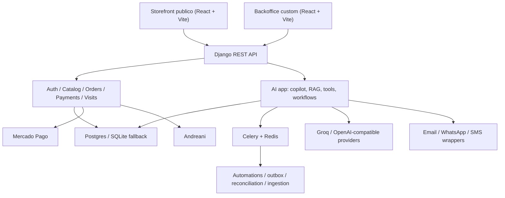
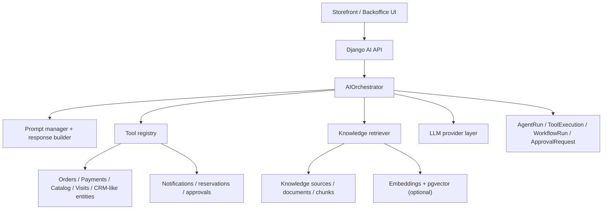
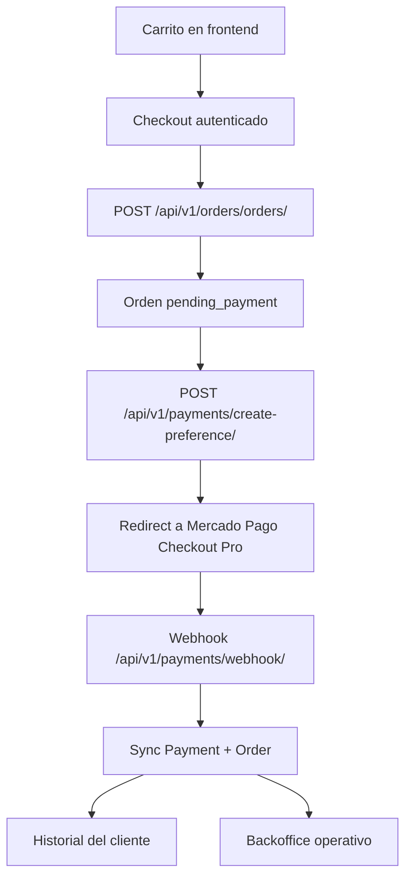
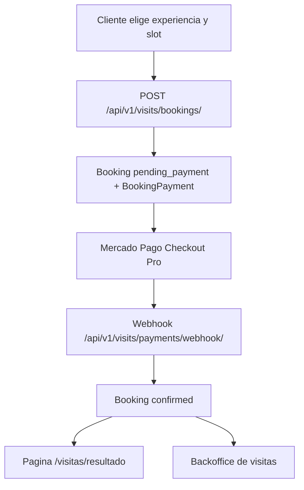
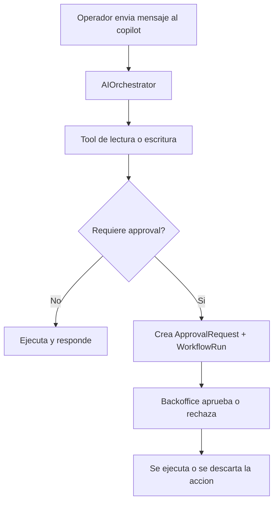

# Bodega La Abeja

E-commerce vitivinicola + backoffice AI-first para una bodega de San Rafael, Mendoza.

Este monorepo ya no es solo un storefront con carrito y CRUD de catalogo. Hoy combina:

- storefront editorial en React para catalogo, carrito, checkout, pedidos y visitas
- backend Django REST para auth, catalogo, ordenes, pagos, reservas y operaciones internas
- backoffice custom para equipos de negocio, operaciones y hospitalidad
- capa AI con copilot operativo, RAG, tool-calling, approvals, workflows y audit trail
- automatizaciones con Celery para carritos abandonados, promos, outbox y reconciliaciones

## Estado actual del producto

Lo mas valioso del proyecto hoy:

- checkout real fase 1 con creacion de ordenes y Mercado Pago Checkout Pro
- webhook de pagos y sincronizacion de `Payment` + `Order`
- historial y detalle de pedidos para cliente autenticado o acceso invitado
- cotizacion de envios y soporte de fulfillment con Andreani
- modulo completo de visitas con experiencias, slots, reserva y pago via Mercado Pago
- backoffice custom para catalogo, pedidos, visitas, metricas y cola operativa
- copilot interno con tools sobre pedidos, pagos, stock, catalogo, ventas y visitas
- base de conocimiento con documentos publicos e internos
- retrieval lexico + semantico opcional con fallback elegante cuando no hay embeddings
- aprobaciones humanas para writes riesgosos
- trazabilidad de runs, tool executions y workflows
- evals deterministicas para regresiones del agente

## Arquitectura general



## Arquitectura AI



## Superficies del producto

### Storefront publico

Rutas principales:

- `/`
- `/vinos`
- `/vinos/:slug`
- `/carrito`
- `/checkout`
- `/checkout/resultado`
- `/pedidos`
- `/pedidos/:id`
- `/visitas`
- `/visitas/resultado`
- `/historia`
- `/regalos`
- `/guia-de-compra`
- `/contacto`

Incluye:

- landing editorial con narrativa de marca
- catalogo filtrable
- fichas de vino con notas de cata, premios y contenido comercial
- carrito persistido
- checkout autenticado
- historial y detalle de pedidos
- reserva de visitas con seleccion de experiencia, cupo y horario
- resultado de pago para compras y visitas

### Backoffice custom

Ruta principal:

- `/backoffice/login`

Modulos visibles hoy:

- dashboard operativo
- copilot de operaciones
- metricas comerciales
- tareas AI
- approvals AI
- reservas de stock
- cancelaciones
- visitas
- pedidos
- vinos
- categorias
- varietales

## Modulos funcionales

### Commerce

- catalogo publico y featured wines
- reviews por vino
- carrito con promo codes
- ordenes con estados de pago, preparacion, envio, entrega, cancelacion y refund
- detalle de pedido con posibilidad de cancelacion cuando aplica
- tracking y artifacts de fulfillment con Andreani

### Visitas y hospitalidad

- experiencias publicas (`Experience`)
- slots por fecha y capacidad (`TimeSlot`)
- reservas con estado y confirmacion (`Booking`)
- pago de visita con Mercado Pago (`BookingPayment`)
- backoffice para experiencias, slots y bookings

### Backoffice operativo

- dashboard agregado de negocio
- metricas de ventas por periodo
- gestion de catalogo
- cola de pedidos
- seguimiento de reservas y experiencias
- decisioning manual sobre approvals y cancelaciones

## Capa AI-first

La app `backend/apps/ai/` esta pensada como capa operativa real, no como un chat aislado.

### Runtime de agente

Incluye:

- `AIOrchestrator` para persistir turnos, detectar intent, invocar tools y consolidar respuesta
- `ToolCallingAgent` para ejecutar el loop de herramientas
- `LLMProviderFactory` y providers OpenAI-compatible desacoplados del runtime
- prompts separados para soporte y operaciones
- `ResponseBuilder` para grounding y salida final

Configuracion actual:

- proveedor default: `groq`
- modelos configurables por entorno
- embeddings opcionales
- maximo de iteraciones y costos estimados por env vars

### Tool-calling conectado al negocio

El copilot no opera sobre mocks. Ejecuta tools contra entidades reales de:

- catalogo
- ordenes
- pagos
- stock
- notas internas
- leads
- tareas
- reservas de stock
- visitas y bookings
- metricas comerciales
- comunicaciones por email / WhatsApp

Ejemplos de tools implementadas:

- `search_visit_context`
- `get_order_by_number`
- `search_orders`
- `search_catalog`
- `get_stock_snapshot`
- `search_knowledge_base`
- `classify_customer_message`
- `recommend_wines_for_customer`
- `check_payment_issue`
- `generate_shipping_update`
- `create_support_task`
- `create_internal_note`
- `create_lead_from_conversation`
- `reserve_stock`
- `release_stock_reservation`
- `update_order_status`
- `request_order_cancellation`
- `send_whatsapp_message`
- `send_support_email`
- `get_sales_summary`
- `get_sales_over_period`
- `get_sales_by_varietal`
- `get_conversion_funnel`
- `get_returns_and_incidents_metrics`

### Human-in-the-loop y approvals

Las acciones con side effects relevantes no se ejecutan a ciegas. La capa AI modela:

- `AgentRun`
- `ToolExecution`
- `WorkflowRun`
- `ApprovalRequest`
- `SupportTask`
- `Lead`
- `StockReservation`

Esto habilita un flujo claro:

1. el agente entiende la intencion
2. decide si necesita tools, conocimiento o ambos
3. si la accion es riesgosa, crea el approval y deja el workflow pendiente
4. un operador aprueba o rechaza desde backoffice
5. todo queda auditado end-to-end

### RAG y base de conocimiento

La base de conocimiento usa:

- `KnowledgeSource`
- `KnowledgeDocument`
- `KnowledgeChunk`
- `KnowledgeIngestionService`
- `KnowledgeRetriever`
- `VectorStore`

Capacidades actuales:

- ingestion idempotente por `source + external_id`
- chunking de documentos
- canales `public` e `internal`
- retrieval lexico siempre disponible
- retrieval semantico opcional con `pgvector`
- fusion de resultados lexico + semantico
- citas por documento/chunk en las respuestas

Comportamiento importante:

- si hay embeddings y `pgvector`, el retrieval suma busqueda semantica
- si no hay embeddings o no hay extension vectorial, el sistema sigue funcionando con busqueda lexica
- el soporte al cliente consume conocimiento publico
- el copilot interno puede usar conocimiento interno tambien

### Observabilidad y evaluacion

Cada corrida persiste:

- texto del mensaje
- intent detectado
- modelo utilizado
- confidence
- citas
- metadata de ejecucion
- tools ejecutadas o bloqueadas
- errores
- timestamps

El proyecto tambien incluye:

- `EvalRunner`
- comando `run_ai_evals`
- tests del runtime, tools, retriever, embeddings, prompts, workflows y API

## APIs principales

### Auth

- `POST /api/v1/auth/register/`
- `POST /api/v1/auth/login/`
- `POST /api/v1/auth/logout/`
- `POST /api/v1/auth/token/refresh/`
- `POST /api/v1/auth/password/reset/`
- `POST /api/v1/auth/password/reset/confirm/`
- `POST /api/v1/auth/password/change/`
- `GET /api/v1/auth/profile/`

### Catalogo

- `GET /api/v1/catalog/wines/`
- `GET /api/v1/catalog/wines/featured/`
- `GET /api/v1/catalog/wines/<slug>/`
- `GET|POST /api/v1/catalog/wines/<slug>/reviews/`
- `GET /api/v1/catalog/categories/`
- `GET /api/v1/catalog/varietals/`

### Ordenes y envios

- `POST /api/v1/orders/shipping-quotes/`
- `GET /api/v1/orders/shipping/localities/`
- `GET /api/v1/orders/shipping/branches/`
- `GET|POST /api/v1/orders/orders/`
- `GET /api/v1/orders/orders/<uuid>/`
- `POST /api/v1/orders/orders/<uuid>/cancel/`

### Pagos

- `POST /api/v1/payments/create-preference/`
- `POST /api/v1/payments/webhook/`

### Visitas

- `GET /api/v1/visits/experiences/`
- `GET /api/v1/visits/slots/`
- `GET|POST /api/v1/visits/bookings/`
- `GET /api/v1/visits/bookings/<uuid>/`
- `POST /api/v1/visits/payments/webhook/`

### Backoffice

- `GET /api/v1/backoffice/dashboard/`
- `GET /api/v1/backoffice/sales-metrics/`
- `GET|POST /api/v1/backoffice/categories/`
- `GET|PUT|PATCH|DELETE /api/v1/backoffice/categories/<id>/`
- `GET|POST /api/v1/backoffice/varietals/`
- `GET|PUT|PATCH|DELETE /api/v1/backoffice/varietals/<id>/`
- `GET|POST /api/v1/backoffice/wines/`
- `GET|PUT|PATCH|DELETE /api/v1/backoffice/wines/<uuid>/`
- `GET /api/v1/backoffice/orders/`
- `GET /api/v1/backoffice/orders/<uuid>/`
- `GET|POST /api/v1/backoffice/visits/experiences/`
- `GET|PUT|PATCH|DELETE /api/v1/backoffice/visits/experiences/<uuid>/`
- `GET|POST /api/v1/backoffice/visits/slots/`
- `GET|PUT|PATCH|DELETE /api/v1/backoffice/visits/slots/<id>/`
- `GET /api/v1/backoffice/visits/bookings/`
- `GET|PUT|PATCH|DELETE /api/v1/backoffice/visits/bookings/<uuid>/`

### AI

#### Chat y copilot

- `POST /api/v1/ai/chat/sessions/`
- `GET /api/v1/ai/chat/sessions/<uuid>/`
- `POST /api/v1/ai/chat/sessions/<uuid>/messages/`
- `GET /api/v1/ai/chat/sessions/<uuid>/events/`
- `POST /api/v1/ai/chat/sessions/<uuid>/feedback/`
- `POST /api/v1/ai/copilot/messages/`
- `GET /api/v1/ai/copilot/overview/`

#### Auditoria y artefactos operativos

- `GET /api/v1/ai/runs/<uuid>/`
- `GET /api/v1/ai/runs/<uuid>/steps/`
- `GET /api/v1/ai/tasks/`
- `GET|PUT|PATCH /api/v1/ai/tasks/<uuid>/`
- `GET /api/v1/ai/stock-reservations/`
- `GET /api/v1/ai/leads/`
- `GET|PUT|PATCH /api/v1/ai/leads/<uuid>/`
- `GET /api/v1/ai/approvals/`
- `GET /api/v1/ai/approvals/<uuid>/`
- `POST /api/v1/ai/approvals/<uuid>/approve/`
- `POST /api/v1/ai/approvals/<uuid>/reject/`

#### Knowledge ops, workflows y metricas

- `GET|POST /api/v1/ai/knowledge/sources/`
- `POST /api/v1/ai/knowledge/sources/<id>/sync/`
- `GET /api/v1/ai/knowledge/documents/`
- `POST /api/v1/ai/knowledge/reindex/`
- `POST /api/v1/ai/workflows/lead-triage/run/`
- `POST /api/v1/ai/workflows/order-exception/run/`
- `POST /api/v1/ai/workflows/abandoned-cart/run/`
- `GET /api/v1/ai/workflows/runs/<uuid>/`
- `GET /api/v1/ai/metrics/summary/`

## Flujos de negocio importantes

### Checkout ecommerce



### Reserva de visitas



### AI approval flow



## Automatizaciones y jobs programados

Celery Beat hoy agenda:

- `check-abandoned-carts`
- `send-birthday-discounts`
- `dispatch-transactional-outbox`
- `reconcile-payments-and-shipments`

Eso cubre:

- recuperacion de carritos abandonados
- descuentos de cumpleanos
- despacho de outbox transaccional
- conciliacion de pagos externos y fulfillment Andreani

## Stack

### Backend

- Python 3.12
- Django 5
- Django REST Framework
- Simple JWT
- django-filter
- Celery
- Redis
- structlog
- PostgreSQL
- `pgvector` opcional
- Mercado Pago SDK

### Frontend

- React 18
- TypeScript
- Vite
- React Router
- React Query
- Zustand
- Framer Motion
- Tailwind CSS
- Mercado Pago React SDK

### Calidad y DX

- pytest
- Vitest
- ESLint
- Ruff
- mypy
- Docker Compose
- GitHub Actions
- Render Blueprint (`render.yaml`)

## Estructura del repositorio

```text
La-Abeja/
├── backend/
│   ├── apps/
│   │   ├── ai/
│   │   ├── authentication/
│   │   ├── automations/
│   │   ├── catalog/
│   │   ├── notifications/
│   │   ├── orders/
│   │   ├── payments/
│   │   └── reservations/
│   ├── config/
│   ├── management/
│   └── requirements/
├── docs/
├── frontend/
│   ├── src/
│   │   ├── api/
│   │   ├── components/
│   │   ├── hooks/
│   │   ├── lib/
│   │   ├── pages/
│   │   ├── store/
│   │   └── types/
│   ├── Dockerfile
│   └── vercel.json
├── docker-compose.yml
├── docker-compose.prod.yml
├── Makefile
├── render.yaml
└── .env.example
```

## Levantarlo con Docker

### 1. Variables de entorno

```bash
cp .env.example .env
```

Variables minimas para una demo funcional:

- `DEMO_ADMIN_EMAIL`
- `DEMO_ADMIN_PASSWORD`
- `DATABASE_URL`
- `FRONTEND_URL`
- `BACKEND_URL`
- `VITE_MERCADOPAGO_PUBLIC_KEY`

Variables necesarias para capacidades reales:

- `MERCADOPAGO_ACCESS_TOKEN`
- `MERCADOPAGO_PUBLIC_KEY`
- `MERCADOPAGO_WEBHOOK_SECRET`
- `GROQ_API_KEY`
- `ANDREANI_API_KEY` si queres cotizacion/fulfillment real

### 2. Servicios de desarrollo

`docker-compose.yml` levanta:

- `db` con `pgvector/pgvector:pg16`
- `redis`
- `backend`
- `celery_worker`
- `celery_beat`
- `frontend`

### 3. Comandos

```bash
make dev
make migrate
make seed
make seed-ai
make seed-ai-demo
```

URLs locales:

- storefront: [http://127.0.0.1:3000](http://127.0.0.1:3000)
- backoffice: [http://127.0.0.1:3000/backoffice/login](http://127.0.0.1:3000/backoffice/login)
- backend API: [http://127.0.0.1:8000](http://127.0.0.1:8000)
- healthcheck: [http://127.0.0.1:8000/health/](http://127.0.0.1:8000/health/)

## Levantarlo sin Docker

### 1. Variables de entorno

```bash
cp .env.example .env
cp frontend/.env.example frontend/.env
```

Para desarrollo liviano fuera de Docker podes usar:

- `DATABASE_URL=sqlite:///db.sqlite3`
- `AI_ENABLE_PGVECTOR=False`

### 2. Backend

```bash
.venv/bin/pip install -r backend/requirements/development.txt
cd backend
../.venv/bin/python manage.py migrate
../.venv/bin/python manage.py seed_demo_data
../.venv/bin/python manage.py seed_ai_knowledge
../.venv/bin/python manage.py runserver 127.0.0.1:8000
```

Si queres el dataset operativo grande para AI y metricas:

```bash
cd backend
../.venv/bin/python manage.py seed_ai_demo_data
```

### 3. Frontend

```bash
cd frontend
npm install
npm run dev -- --host 127.0.0.1 --port 3000
```

## Variables de entorno clave

### Backend general

- `SECRET_KEY`
- `DEBUG`
- `ALLOWED_HOSTS`
- `FRONTEND_URL`
- `BACKEND_URL`
- `CORS_ALLOWED_ORIGINS`
- `CSRF_TRUSTED_ORIGINS`

### Base de datos y workers

- `DATABASE_URL`
- `REDIS_URL`
- `CELERY_BROKER_URL`
- `CELERY_RESULT_BACKEND`
- `CACHE_URL`

### Mercado Pago

- `MERCADOPAGO_ACCESS_TOKEN`
- `MERCADOPAGO_PUBLIC_KEY`
- `VITE_MERCADOPAGO_PUBLIC_KEY`
- `MERCADOPAGO_WEBHOOK_SECRET`
- `MERCADOPAGO_COLLECTOR_ID`

### Andreani

- `ANDREANI_API_KEY`
- `ANDREANI_API_BASE_URL`
- `ANDREANI_ORDER_PATH`
- `ANDREANI_TRACKING_URL_TEMPLATE`

### Email / Brevo SMTP

- `DEFAULT_FROM_EMAIL`
- `DEFAULT_FROM_NAME`
- `EMAIL_HOST=smtp-relay.brevo.com`
- `EMAIL_PORT=587`
- `EMAIL_HOST_USER`
- `EMAIL_HOST_PASSWORD`
- `EMAIL_USE_TLS=True`

### AI

- `AI_LLM_PROVIDER`
- `GROQ_API_KEY`
- `GROQ_BASE_URL`
- `AI_CHAT_MODEL`
- `AI_REASONING_MODEL`
- `AI_EMBEDDING_MODEL`
- `AI_ENABLE_PGVECTOR`
- `AI_EMBEDDING_DIMENSIONS`
- `AI_PROVIDER_MAX_TOOL_ITERATIONS`

## Comandos utiles

### Orquestacion local

```bash
make dev
make dev-bg
make down
```

### Base de datos y seeds

```bash
make migrate
make makemigrations
make seed
make seed-ai
make seed-ai-demo
make reindex-ai
```

### Tests y calidad

```bash
make backend-test
make frontend-test
make lint
make format
make evals-ai
```

Equivalentes utiles sin Docker:

```bash
PYTHONPATH=backend .venv/bin/ruff check backend
PYTHONPATH=backend .venv/bin/mypy backend --config-file backend/pyproject.toml
DJANGO_SETTINGS_MODULE=config.settings.testing PYTHONPATH=backend .venv/bin/pytest backend -q

cd frontend
npm run typecheck
npm run lint
npm run test -- --run
```

## Deploy

### Render + Vercel

Guia completa: [docs/deploy-render-vercel.md](docs/deploy-render-vercel.md)

La estrategia mas simple para este monorepo hoy es:

- backend Django en Render
- worker Celery y beat en Render
- Postgres y Redis/Key Value en Render
- frontend Vite en Vercel

### Render Blueprint

El repo incluye [`render.yaml`](render.yaml) con:

- web service para Django
- worker para Celery
- worker para Celery Beat
- Redis
- Postgres

Notas importantes:

- el `buildCommand` del backend corre install + migrate + collectstatic + seeds
- en free tier es util para demo, no para operacion estable
- la parte AI sigue funcionando con retrieval lexico aunque no tengas embeddings activos

### Vercel

El frontend esta preparado para desplegarse desde el subdirectorio `frontend` con:

- framework preset `Vite`
- build `npm run build`
- output `dist`
- rewrite SPA via `frontend/vercel.json`

Variables recomendadas:

```bash
VITE_API_URL=https://tu-backend.onrender.com/api/v1
VITE_ASSET_BASE_URL=https://tu-backend.onrender.com
VITE_MERCADOPAGO_PUBLIC_KEY=APP_USR-xxxx
```

## Acceso demo

Si corres `seed_demo_data` con los defaults de [`.env.example`](.env.example):

- email: `admin@bodegalaabeja.com.ar`
- contrasena: `LaAbejaAdmin2026!`

## Documentacion extra

- [docs/ai-support-operations-agent-architecture.md](docs/ai-support-operations-agent-architecture.md)
- [docs/la-abeja-agent-scope.md](docs/la-abeja-agent-scope.md)
- [docs/deploy-render-vercel.md](docs/deploy-render-vercel.md)

## Limitaciones actuales

- el checkout esta en fase 1; todavia no cubre todos los edge cases de una operacion productiva
- el retrieval semantico depende de embeddings y de una base con soporte vectorial
- parte de los workflows AI estan optimizados para demo y operacion controlada
- faltan mas conectores reales para knowledge sync externo
- la observabilidad de integraciones externas puede endurecerse mas para produccion

## Roadmap sugerido

### AI / producto

- mas evals automaticas y datasets de regresion
- versionado mas fuerte de prompts y tools
- memoria mas rica por cliente y por cuenta
- conectores de ingestion desde CMS, docs o PDFs
- dashboards de calidad del agente y approval throughput

### Commerce / operations

- maduracion del checkout
- hardening de fulfillment y tracking
- acciones masivas sobre catalogo
- mejoras de operacion para pagos, envios y notificaciones
- mayor profundidad en visitas, hospitalidad y eventos
- conectar el backend de email transaccional a un proveedor productivo, por ejemplo AWS SES

## Licencia y uso

Proyecto creado como portfolio / showcase tecnico. Antes de usarlo en produccion conviene completar:

- hardening de seguridad
- observabilidad mas profunda
- backups y estrategia de recuperacion
- operacion real de servicios externos
- cierre de flujos pendientes de negocio
