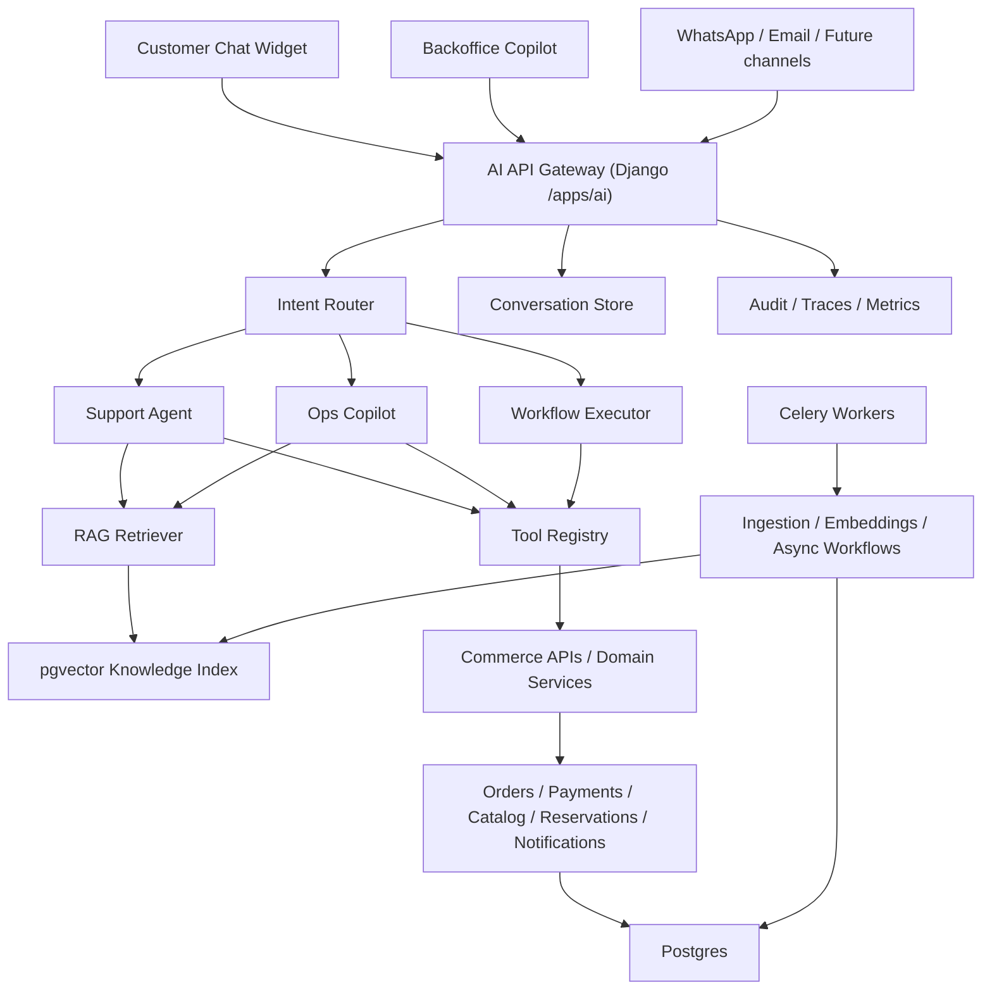

# La Abeja - AI Support & Operations Agent

## Executive Summary

La mejor decision para La Abeja no es construir "un chatbot con RAG", sino una capa AI operativa sobre el stack actual.

Recomendacion principal:

- Mantener `Django + DRF + Postgres + Redis/Celery + React`.
- Agregar un modulo `apps.ai` dentro del monolito.
- Usar `RAG` solo para conocimiento no estructurado o semi-estructurado.
- Usar `tools/API calls` para datos vivos y source-of-truth: pedidos, stock, pagos, reservas, clientes.
- Separar el sistema en tres lanes:
  - `Customer Support Agent`
  - `Backoffice Ops Copilot`
  - `Workflow Executor`
- Poner aprobaciones humanas para toda accion con side effects.

La arquitectura correcta no es "un agente libre". Es un sistema con:

- ruteo,
- retrieval disciplinado,
- tool calling fuertemente tipado,
- memoria acotada,
- observabilidad,
- y guardrails.

## 1. La mejor arquitectura posible

### Arquitectura objetivo



### Principios de arquitectura

- `Deterministic core, probabilistic edges`
  - El negocio vive en APIs, reglas, DB y validaciones.
  - El LLM decide, redacta, resume y planea.
  - El LLM no es la fuente de verdad.

- `Single orchestrator, bounded tools`
  - Un orquestador central.
  - Tools chicas, tipadas, auditables y con permisos.

- `RAG only where RAG is appropriate`
  - FAQ, politicas, contenido comercial, guias, docs internas.
  - Nunca stock, pagos, ordenes, disponibilidad o precio final.

- `Human approval for write actions`
  - Enviar mensajes, crear descuentos, disparar tareas, modificar pedidos o tocar reservas requiere politica y, segun riesgo, aprobacion.

- `Progressive autonomy`
  - Fase 1: responder y consultar.
  - Fase 2: sugerir acciones.
  - Fase 3: ejecutar con aprobacion.
  - Fase 4: ejecutar autonomamente solo acciones de bajo riesgo.

### Decision de alto nivel

Para La Abeja recomiendo un `modular monolith AI layer` dentro de Django, no un microservicio separado de entrada.

Por que:

- el stack actual ya es Django/DRF/Postgres/Redis;
- los datos del agente son mayormente relacionales;
- los tools deben tocar modelos y servicios de negocio existentes;
- simplifica seguridad, permisos, observabilidad y despliegue.

Cuando extraer:

- si el trafico AI crece mucho,
- si aparecen multiples canales externos,
- si el workflow engine se complejiza,
- o si el retrieval necesita escalar de forma independiente.

## 2. Que partes deberian usar LLMs

Usaria LLM en estas partes:

- `Intent classification`
  - detectar si el mensaje es FAQ, estado de pedido, recomendacion, regalo corporativo, visita, reclamo, operacion interna, etc.

- `Query rewriting`
  - reformular consultas para retrieval y filtros.

- `Tool planning`
  - decidir si responder directo, usar RAG, usar tools o combinar ambos.

- `Grounded answer generation`
  - redactar la respuesta final usando resultados de tools + contexto RAG + politicas.

- `Lead / case summarization`
  - generar resumen operativo para backoffice.

- `Entity extraction`
  - order_number, email, sku, provincia, fecha, cantidad de invitados, presupuesto, etc.

- `Escalation decision`
  - decidir si derivar a humano por baja confianza, alto riesgo o frustracion del cliente.

- `Workflow composition`
  - componer pasos simples como "buscar pedido -> validar estado -> sugerir respuesta -> crear tarea".

No usaria LLM para:

- permisos,
- validacion de ownership,
- lectura de stock real,
- transiciones de estados,
- calculo de precios,
- conciliacion de pagos,
- enforcement de reglas de negocio.

## 3. Que partes deberian usar RAG

RAG debe usarse solo para conocimiento textual que no vive bien como tool estructurado.

### Usos correctos de RAG

- FAQs de compra
- envios
- retiro en bodega
- visitas y hospitalidad
- regalos y programas corporativos
- politicas de cambios/cancelaciones
- contenidos de marca
- fichas de producto narrativas
- scripts de soporte y ventas
- documentos internos del equipo

### No usar RAG para

- estado de una orden
- disponibilidad de stock
- monto de un pago
- tracking number
- disponibilidad de slots
- datos personales del cliente
- promociones activas del usuario

Esos casos deben ir por tool/API.

### Regla simple

- `knowledge question` -> RAG
- `current state question` -> tool
- `action request` -> tool + policy + approval

## 4. Que herramientas/actions deberia tener el agente

### Customer-facing read tools

- `get_order_by_number`
- `get_customer_orders`
- `get_order_payment_status`
- `get_order_shipping_summary`
- `get_product_by_slug_or_sku`
- `search_catalog`
- `get_stock_snapshot`
- `get_reservation_info`
- `get_visit_faq`
- `search_knowledge_base`

### Customer-facing low-risk actions

- `create_contact_lead`
- `create_support_case`
- `request_human_followup`
- `draft_whatsapp_reply`
- `draft_email_reply`

### Ops / backoffice tools

- `list_low_stock_items`
- `list_pending_orders`
- `summarize_order_exception`
- `recommend_substitute_products`
- `classify_incoming_inquiry`
- `create_internal_task`
- `assign_case_to_team`
- `draft_customer_reply`

### Higher-risk tools behind approval

- `send_whatsapp_message`
- `send_email_message`
- `apply_manual_tag_to_case`
- `create_discount_code`
- `create_reservation_hold`
- `trigger_recovery_workflow`

### Tool design principles

- una responsabilidad por tool
- argumentos estrictos por JSON Schema
- outputs estructurados
- errores estandarizados
- timeouts
- idempotency keys para side effects
- audit log obligatorio

## 5. Que datos necesito indexar

### Dataset de RAG

- `FAQ content`
  - guia de compra
  - envios
  - retiro
  - visitas
  - regalos

- `commercial content`
  - textos de producto
  - notas de cata
  - maridajes
  - premios
  - diferenciadores de marca

- `policies`
  - pagos
  - cancelaciones
  - devoluciones
  - reservas
  - retiro

- `ops knowledge`
  - playbooks de soporte
  - macros de respuesta
  - criterios de escalacion
  - SLA internos

- `future enterprise content`
  - Google Docs
  - Notion
  - PDFs
  - tickets historicos
  - transcripciones de WhatsApp si se integran

### Datos que no indexaria como vector primary source

- tablas de ordenes
- pagos
- stock
- customers
- slots
- reservations

Esos datos los mantendria en Postgres y se leerian via tools.

### Metadata por chunk

Cada chunk debe llevar:

- `tenant_id`
- `source_type`
- `source_id`
- `document_id`
- `language`
- `channel`
- `topic`
- `product_ids`
- `category_ids`
- `is_public`
- `is_internal`
- `effective_from`
- `effective_to`
- `version`
- `checksum`

## 6. Que vector DB usar

### Recomendacion para La Abeja

Usaria `Postgres + pgvector` como vector DB principal.

### Por que pgvector es la mejor decision aca

- La Abeja ya vive en un stack relacional.
- El corpus inicial no va a ser masivo.
- El retrieval necesita filtros fuertes por metadata.
- Simplifica backup, seguridad, joins, auditoria y operacion.
- Evita meter otra pieza infra antes de que realmente haga falta.

### Configuracion recomendada

- tabla `knowledge_chunk`
- columna `embedding vector(...)`
- indice `HNSW` con distancia coseno
- columna `tsvector` para keyword search
- retrieval `hybrid`: vector + lexical + rerank

### Cuando migraria a Qdrant

Evaluaria Qdrant si aparece alguno de estos gatillos:

- mas de `1M-2M` chunks
- QPS alto y p95 de retrieval muy exigente
- multiples colecciones con distinto schema y tuning ANN
- necesidad fuerte de hybrid search avanzado o multivector retrieval
- necesidad de escalar retrieval por separado del OLTP

### Decision profesional

- `Hoy`: pgvector
- `Path to scale`: interfaz `VectorStore` para poder swappear a Qdrant sin tocar el orquestador

## 7. Como implementar embeddings

### Modelo de embeddings

Recomendacion:

- `text-embedding-3-large` para KB de produccion

Motivo:

- segun la documentacion oficial, es el embedding model mas capaz y sirve bien para tareas en ingles y no ingles;
- La Abeja opera en espanol y mezcla contenido comercial, operativo y de producto.

### Estrategia de embedding

- `offline embeddings` para documentos
- `online embeddings` para queries
- `batch jobs` para reindexado
- versionar embedding model por chunk

### Chunking strategy

No usar un solo chunker para todo.

- FAQ / policies
  - `300-500 tokens`, overlap `50-80`

- product narratives
  - `200-350 tokens`, overlap `30-50`

- internal docs / procedures
  - `500-800 tokens`, overlap `80-120`

### Enrichment antes de embed

Cada chunk deberia ser embebido con contexto:

- titulo del documento
- subtitulo
- seccion
- canal
- idioma
- texto limpio del chunk

Ejemplo:

```text
document_title: Guia de compra
section: Retiro en bodega
channel: public
language: es-AR
content: El retiro en bodega se coordina luego de la confirmacion...
```

### Reindexing policy

- reembed cuando cambia contenido
- guardar `content_hash`
- upsert idempotente
- soft-delete chunks obsoletos
- rebuild nocturno o on-demand para cambios grandes

## 8. Que stack usar

### Backend

- `Python 3.12`
- `Django`
- `Django REST Framework`
- `Postgres`
- `pgvector`
- `Redis`
- `Celery`
- `OpenAI Python SDK`
- `Pydantic` para schemas de tools y salidas estructuradas
- `structlog`
- `OpenTelemetry` para traces

### Frontend

- `React 18`
- `TypeScript`
- `Vite`
- `React Query`
- `Zustand` solo si hace falta estado de sesion del chat
- `SSE` para streaming de respuestas

### Infra

- app API
- worker Celery
- beat scheduler
- Postgres
- Redis
- object storage para adjuntos y documentos

### Nota sobre workflow engine

Con el stack actual, Celery alcanza para:

- ingestion,
- reindexado,
- workflows simples,
- retries basicos.

Si el producto evoluciona a procesos largos con aprobaciones, compensaciones y estados complejos, el salto natural es:

- `Temporal` para workflows de larga vida

No lo meteria en fase 1.

## 9. Como estructurar backend y frontend

## Backend propuesto

```text
backend/
  apps/
    ai/
      __init__.py
      apps.py
      urls.py
      admin.py
      api/
        serializers.py
        views.py
        permissions.py
        schemas.py
      models/
        __init__.py
        conversations.py
        knowledge.py
        memory.py
        runs.py
        workflows.py
      agents/
        orchestrator.py
        support_agent.py
        ops_agent.py
        workflow_agent.py
        policy_engine.py
        prompt_manager.py
        response_builder.py
      rag/
        chunkers.py
        ingest.py
        retriever.py
        reranker.py
        citations.py
        vector_store.py
      tools/
        base.py
        registry.py
        catalog_tools.py
        order_tools.py
        payment_tools.py
        reservation_tools.py
        notification_tools.py
        case_tools.py
      services/
        llm_client.py
        embedding_service.py
        moderation_service.py
        memory_service.py
        tracing_service.py
        audit_service.py
      workflows/
        abandoned_cart_followup.py
        lead_triage.py
        order_exception.py
        reservation_followup.py
      tasks/
        ingestion_tasks.py
        embedding_tasks.py
        workflow_tasks.py
      tests/
        test_agents.py
        test_tools.py
        test_rag.py
        test_api.py
        test_policies.py
```

## Frontend propuesto

```text
frontend/src/
  features/
    ai/
      api.ts
      types.ts
      hooks/
        useChatSession.ts
        useChatStream.ts
        useAgentRun.ts
      components/
        ChatLauncher.tsx
        ChatPanel.tsx
        MessageList.tsx
        CitationCard.tsx
        ToolExecutionCard.tsx
        ApprovalRequestCard.tsx
        SuggestedActions.tsx
      pages/
        BackofficeCopilotPage.tsx
```

### UX recomendada

- `Customer widget`
  - chat simple
  - citas visibles
  - tarjetas de pedido/producto
  - fallback a humano

- `Backoffice copilot`
  - panel lateral o pagina propia
  - tool results estructurados
  - aprobaciones
  - resumen de caso
  - botones de accion

## 10. Como implementar seguridad y validaciones

### Security model

- `RBAC`
  - guest
  - authenticated_customer
  - staff
  - ops_admin

- `tool scopes`
  - `kb.read_public`
  - `catalog.read`
  - `order.read.self`
  - `order.read.any`
  - `reservation.read`
  - `message.send`
  - `workflow.execute.low_risk`
  - `workflow.execute.high_risk`

### Validaciones obligatorias

- ownership server-side
- schema validation de cada tool input con Pydantic
- whitelists para enums y estados
- rate limiting por IP y por user
- payload size limits
- idempotency keys en side effects
- audit trail de:
  - prompt version
  - retrieved docs
  - tool calls
  - actor
  - outputs

### Guardrails criticos

- no pasar secretos a prompts
- no pasar PII innecesaria al modelo
- redactar datos sensibles en logs
- separar claramente:
  - `system prompt`
  - `user message`
  - `retrieved context`
  - `tool outputs`

- todo documento recuperado debe entrar como `data`, nunca como `instruction`

### Write safety

Clasificar tools por riesgo:

- `read_only`
- `low_risk_write`
- `high_risk_write`

Politica:

- read_only -> auto
- low_risk_write -> auto con auditoria
- high_risk_write -> approval humana

## 11. Como evitar hallucinations

### Reglas base

- para datos vivos, usar tools, no memoria del modelo
- para conocimiento, usar RAG con citas
- si no hay evidencia suficiente, responder "no tengo suficiente informacion"
- nunca permitir que el LLM improvise estados, montos o stock

### Respuesta grounded

Toda respuesta del agente debe salir con un envelope interno:

```json
{
  "answer": "...",
  "evidence": ["doc:faq_shipping#chunk_12", "tool:get_order_status"],
  "confidence": 0.92,
  "needs_human": false
}
```

### Tecnicas concretas

- hybrid retrieval
- reranking
- max context control
- source weighting
- schema-validated outputs
- answer templates para order/payment support
- fallback por baja confianza
- golden eval set con preguntas reales

### Anti-prompt-injection

- sanitation de contenido recuperado
- strip de instrucciones embebidas en docs
- no ejecutar tools por texto recuperado
- el modelo no puede expandir el set de tools
- politica externa decide si un tool es callable

## 12. Como implementar tool calling

### Patron recomendado

Usar `Responses API` con function calling.

Flujo:

1. request al modelo con tools disponibles
2. el modelo pide tool call
3. el backend ejecuta la tool
4. el backend devuelve tool output al modelo
5. el modelo responde al usuario o pide otra tool

### Tool contract

Cada tool debe definir:

- `name`
- `description`
- `input_schema`
- `output_schema`
- `required_scope`
- `risk_level`
- `timeout_ms`

### Ejemplo de schema

```python
from pydantic import BaseModel, Field


class GetOrderByNumberInput(BaseModel):
    order_number: str = Field(min_length=5, max_length=30)
    requester_user_id: str | None = None


class GetOrderByNumberOutput(BaseModel):
    found: bool
    order_id: str | None = None
    status: str | None = None
    payment_status: str | None = None
    shipping_method: str | None = None
    tracking_number: str | None = None
```

### Ejemplo de ejecucion

```python
from openai import OpenAI

client = OpenAI()


def run_agent(messages, tools):
    response = client.responses.create(
        model="gpt-5.5",
        input=messages,
        tools=tools,
    )

    while True:
        tool_calls = [item for item in response.output if item.type == "function_call"]
        if not tool_calls:
            return response

        tool_outputs = []
        for call in tool_calls:
            result = execute_tool(call.name, call.arguments)
            tool_outputs.append(
                {
                    "type": "function_call_output",
                    "call_id": call.call_id,
                    "output": result,
                }
            )

        response = client.responses.create(
            model="gpt-5.5",
            previous_response_id=response.id,
            input=tool_outputs,
        )
```

### Tool policy layer

Importante: el modelo no ejecuta tools directo.

Siempre hay una capa intermedia que:

- valida inputs
- chequea permisos
- chequea ownership
- aplica rate limits
- registra auditoria
- en side effects pide aprobacion si corresponde

## 13. Como modelar memoria/contexto

No recomiendo "memoria libre" tipo asistente consumer. Recomiendo memoria en capas.

### Capa 1 - Conversation log

- mensajes completos
- tool results
- citations
- actor
- timestamps

### Capa 2 - Session summary

Resumen rolling para mantener contexto util sin crecer tokens.

Campos:

- motivo principal
- entidades detectadas
- ultimo pedido referido
- tema pendiente
- tono del cliente
- proximos pasos

### Capa 3 - Structured memory facts

Memoria en slots:

- `customer_preferences`
- `preferred_varietals`
- `gift_budget_range`
- `shipping_city`
- `active_order_number`
- `last_intent`

### Capa 4 - Business memory

No va en memoria conversacional. Vive en RAG.

### Regla importante

Usaria `previous_response_id` solo para continuidad corta o streaming, pero la fuente canonica debe ser la DB propia.

Motivo:

- control total,
- portabilidad entre modelos,
- compaction propia,
- auditoria,
- menor acoplamiento,
- mejor control de costo.

## 14. Que endpoints deberia tener

### Customer chat

- `POST /api/v1/ai/chat/sessions/`
- `GET /api/v1/ai/chat/sessions/{session_id}/`
- `POST /api/v1/ai/chat/sessions/{session_id}/messages/`
- `GET /api/v1/ai/chat/sessions/{session_id}/events/`
- `POST /api/v1/ai/chat/sessions/{session_id}/feedback/`

### Backoffice copilot

- `POST /api/v1/ai/copilot/messages/`
- `GET /api/v1/ai/runs/{run_id}/`
- `GET /api/v1/ai/runs/{run_id}/steps/`
- `POST /api/v1/ai/approvals/{approval_id}/approve/`
- `POST /api/v1/ai/approvals/{approval_id}/reject/`

### Knowledge / ingestion admin

- `POST /api/v1/ai/knowledge/sources/`
- `GET /api/v1/ai/knowledge/sources/`
- `POST /api/v1/ai/knowledge/sources/{source_id}/sync/`
- `GET /api/v1/ai/knowledge/documents/`
- `GET /api/v1/ai/knowledge/chunks/`
- `POST /api/v1/ai/knowledge/reindex/`

### Workflow API

- `POST /api/v1/ai/workflows/lead-triage/run/`
- `POST /api/v1/ai/workflows/order-exception/run/`
- `POST /api/v1/ai/workflows/abandoned-cart/run/`
- `GET /api/v1/ai/workflows/runs/{run_id}/`

### Internal eval / ops

- `POST /api/v1/ai/evals/run/`
- `GET /api/v1/ai/evals/reports/{report_id}/`
- `GET /api/v1/ai/metrics/summary/`

## 15. Como dividir el proyecto por fases

### Fase 0 - Foundation

- definir taxonomia de intents
- observabilidad AI
- modelo de auditoria
- KB inicial
- pipeline de ingestion
- eval set inicial

### Fase 1 - Customer Support Agent

- FAQ grounded
- product Q&A
- policy Q&A
- recommendations basicas
- handoff a humano

Resultado:

- reduce tickets repetitivos
- mejora conversion pre-compra

### Fase 2 - Authenticated Order Support

- buscar pedido
- estado de pago
- estado de envio
- tracking
- resumen del pedido

Resultado:

- fuerte impacto en self-service

### Fase 3 - Backoffice Ops Copilot

- clasificar consultas
- resumir casos
- recomendar respuesta
- detectar excepciones
- listar stock bajo
- priorizar pendientes

### Fase 4 - Workflow Automation

- crear tareas
- derivar leads
- followups
- borradores de mensaje
- acciones con approval

### Fase 5 - Omnichannel + Optimization

- WhatsApp
- email
- voice optional
- A/B testing
- prompt/eval loop
- active learning sobre casos reales

## 16. Que metricas de negocio impactaria

### Revenue / conversion

- conversion rate pre-compra
- cart recovery rate
- gift/corporate lead conversion
- visit booking conversion
- AOV por recomendacion asistida

### Support / operations

- first response time
- average handling time
- deflection rate
- self-service order status rate
- escalations per 100 conversations
- SLA compliance

### Commercial quality

- CSAT
- resolution rate
- answer groundedness score
- tool success rate
- approval acceptance rate

### Ops efficiency

- tiempo ahorrado en backoffice
- tiempo de clasificacion de leads
- tiempo de respuesta a regalos/eventos
- incidentes por stock desactualizado

## 17. Como venderlo profesionalmente en entrevistas

### Posicionamiento

No lo vendas como "agregue un chatbot".

Vendelo asi:

- "Construimos una capa AI-first sobre un commerce stack existente."
- "Separamos conocimiento no estructurado de datos transaccionales."
- "RAG para conocimiento, tools para source-of-truth, approvals para side effects."
- "Disenamos un sistema evaluable, auditable y seguro, no un prompt suelto."

### Narrative fuerte

1. Tenias un e-commerce con catalogo, pedidos, pagos y operacion interna.
2. Identificaste que el mayor valor no era responder FAQ solamente.
3. Disenaste un `Support & Operations Agent`.
4. El sistema combina:
   - retrieval,
   - function calling,
   - workflow automation,
   - observabilidad,
   - y guardrails.
5. Priorizaste impacto medible:
   - soporte,
   - conversion,
   - eficiencia operativa.

### Frases que venden bien

- "I designed a production-grade agent architecture, not a demo bot."
- "I separated probabilistic reasoning from deterministic business logic."
- "I used RAG only where retrieval was the right abstraction, and tools for live operational state."
- "High-risk actions were approval-gated and fully audited."
- "The rollout was phased by business risk and measurable value."

## Estructura completa del proyecto

## Django models propuestos

### knowledge.py

```python
class KnowledgeSource(models.Model):
    source_type = models.CharField(max_length=50)  # faq, markdown, cms, pdf, notion
    name = models.CharField(max_length=200)
    uri = models.TextField(blank=True)
    is_active = models.BooleanField(default=True)
    sync_cursor = models.TextField(blank=True)
    last_synced_at = models.DateTimeField(null=True, blank=True)


class KnowledgeDocument(models.Model):
    source = models.ForeignKey(KnowledgeSource, on_delete=models.PROTECT)
    external_id = models.CharField(max_length=200)
    title = models.CharField(max_length=300)
    language = models.CharField(max_length=10, default="es")
    channel = models.CharField(max_length=30, default="public")
    checksum = models.CharField(max_length=64)
    metadata = models.JSONField(default=dict)
    is_active = models.BooleanField(default=True)
    published_at = models.DateTimeField(null=True, blank=True)


class KnowledgeChunk(models.Model):
    document = models.ForeignKey(KnowledgeDocument, related_name="chunks", on_delete=models.CASCADE)
    chunk_index = models.IntegerField()
    content = models.TextField()
    content_tsv = models.TextField(blank=True)
    embedding = VectorField(dimensions=3072)
    token_count = models.IntegerField(default=0)
    metadata = models.JSONField(default=dict)
    embedding_model = models.CharField(max_length=100)
    content_hash = models.CharField(max_length=64)
```

### conversations.py

```python
class Conversation(models.Model):
    channel = models.CharField(max_length=30)  # web, backoffice, whatsapp
    customer = models.ForeignKey(settings.AUTH_USER_MODEL, null=True, blank=True, on_delete=models.SET_NULL)
    session_key = models.CharField(max_length=100, blank=True)
    status = models.CharField(max_length=20, default="open")
    last_intent = models.CharField(max_length=50, blank=True)
    summary = models.TextField(blank=True)
    metadata = models.JSONField(default=dict)


class ConversationTurn(models.Model):
    conversation = models.ForeignKey(Conversation, related_name="turns", on_delete=models.CASCADE)
    role = models.CharField(max_length=20)  # user, assistant, tool, system
    content = models.JSONField(default=dict)
    token_usage = models.JSONField(default=dict)
    citations = models.JSONField(default=list)
    created_at = models.DateTimeField(auto_now_add=True)
```

### runs.py

```python
class AgentRun(models.Model):
    conversation = models.ForeignKey(Conversation, null=True, blank=True, on_delete=models.SET_NULL)
    agent_type = models.CharField(max_length=30)  # support, ops, workflow
    model = models.CharField(max_length=100)
    status = models.CharField(max_length=20, default="running")
    confidence = models.DecimalField(max_digits=4, decimal_places=3, null=True, blank=True)
    needs_human = models.BooleanField(default=False)
    prompt_version = models.CharField(max_length=50)
    input_snapshot = models.JSONField(default=dict)
    output_snapshot = models.JSONField(default=dict)


class ToolExecution(models.Model):
    run = models.ForeignKey(AgentRun, related_name="tool_executions", on_delete=models.CASCADE)
    tool_name = models.CharField(max_length=100)
    risk_level = models.CharField(max_length=20, default="read_only")
    status = models.CharField(max_length=20, default="pending")
    input_payload = models.JSONField(default=dict)
    output_payload = models.JSONField(default=dict)
    latency_ms = models.IntegerField(default=0)
    error = models.TextField(blank=True)
```

### workflows.py

```python
class WorkflowRun(models.Model):
    workflow_type = models.CharField(max_length=50)
    status = models.CharField(max_length=20, default="pending")
    actor_type = models.CharField(max_length=20)  # agent, human, system
    input_payload = models.JSONField(default=dict)
    result_payload = models.JSONField(default=dict)
    idempotency_key = models.CharField(max_length=100, unique=True)


class ApprovalRequest(models.Model):
    workflow_run = models.ForeignKey(WorkflowRun, related_name="approvals", on_delete=models.CASCADE)
    action_name = models.CharField(max_length=100)
    action_payload = models.JSONField(default=dict)
    status = models.CharField(max_length=20, default="pending")
    approved_by = models.ForeignKey(settings.AUTH_USER_MODEL, null=True, blank=True, on_delete=models.SET_NULL)
```

### memory.py

```python
class MemoryFact(models.Model):
    conversation = models.ForeignKey(Conversation, related_name="facts", on_delete=models.CASCADE)
    fact_type = models.CharField(max_length=50)
    key = models.CharField(max_length=100)
    value = models.JSONField(default=dict)
    confidence = models.DecimalField(max_digits=4, decimal_places=3, default=0.8)
    expires_at = models.DateTimeField(null=True, blank=True)
```

## API endpoints propuestos

```text
POST   /api/v1/ai/chat/sessions/
GET    /api/v1/ai/chat/sessions/{id}/
POST   /api/v1/ai/chat/sessions/{id}/messages/
GET    /api/v1/ai/chat/sessions/{id}/events/
POST   /api/v1/ai/chat/sessions/{id}/feedback/

POST   /api/v1/ai/copilot/messages/
GET    /api/v1/ai/runs/{id}/
GET    /api/v1/ai/runs/{id}/steps/

POST   /api/v1/ai/approvals/{id}/approve/
POST   /api/v1/ai/approvals/{id}/reject/

POST   /api/v1/ai/knowledge/sources/
GET    /api/v1/ai/knowledge/sources/
POST   /api/v1/ai/knowledge/sources/{id}/sync/
GET    /api/v1/ai/knowledge/documents/
GET    /api/v1/ai/knowledge/chunks/
POST   /api/v1/ai/knowledge/reindex/

POST   /api/v1/ai/workflows/lead-triage/run/
POST   /api/v1/ai/workflows/order-exception/run/
POST   /api/v1/ai/workflows/abandoned-cart/run/
GET    /api/v1/ai/workflows/runs/{id}/
```

## RAG pipelines propuestos

### Ingestion pipeline

```text
source connector
-> normalize document
-> split by document-aware chunker
-> enrich metadata
-> embed
-> upsert chunks
-> rebuild lexical index
-> mark document version active
```

### Query-time retrieval pipeline

```text
user query
-> intent router
-> if tool-only case: skip RAG
-> query rewrite
-> metadata filter selection
-> semantic retrieval top_k=20
-> lexical retrieval top_k=20
-> fusion
-> rerank top_k=6
-> answer synthesis with citations
-> confidence scoring
```

### Hybrid retrieval note

Con pgvector lo implementaria como:

- vector similarity por coseno
- keyword / trigram / tsvector score
- reciprocal rank fusion o weighted score
- optional rerank con modelo LLM chico o heuristica

## Agentes propuestos

### 1. Support Agent

Responsabilidades:

- responder FAQ
- responder consultas de producto
- buscar pedido del cliente
- explicar estados
- recomendar siguiente paso

No hace:

- mutaciones de negocio de alto riesgo

### 2. Ops Copilot

Responsabilidades:

- resumir casos
- clasificar leads
- sugerir respuesta
- priorizar pendientes
- detectar issues operativos

### 3. Workflow Executor

Responsabilidades:

- ejecutar pipelines chicos
- pedir aprobaciones
- disparar tareas async

## Prompts recomendados

### System prompt - Support Agent

```text
You are La Abeja Support Agent.

Operating rules:
- Treat tools as the source of truth for live business state.
- Treat retrieved knowledge chunks as the source of truth for policies and help content.
- Never invent order status, stock, shipping timelines, reservation availability, or payment state.
- If evidence is insufficient, say so clearly and offer the next best action.
- If an action has side effects, do not claim it was completed unless the tool execution succeeded.
- Prefer concise answers, but always include the concrete next step.
- When using retrieved knowledge, cite the supporting sources internally in the response envelope.
```

### System prompt - Ops Copilot

```text
You are La Abeja Operations Copilot.

Goals:
- reduce operator time,
- surface the most relevant business state,
- propose safe next actions,
- and require approval for risky writes.

You may summarize, classify, draft, and recommend.
You may not bypass policy checks or approvals.
```

### Tool selection prompt addendum

```text
Use RAG only for knowledge questions.
Use tools for live state and transactional data.
If both are needed, retrieve knowledge first only when it improves the explanation, then call the required tools.
```

## Tool registry example

```python
TOOLS = [
    ToolSpec(
        name="get_order_by_number",
        description="Fetch an order by human-readable order number.",
        input_model=GetOrderByNumberInput,
        output_model=GetOrderByNumberOutput,
        scope="order.read.self",
        risk_level="read_only",
    ),
    ToolSpec(
        name="create_support_case",
        description="Create a support case for human follow-up.",
        input_model=CreateSupportCaseInput,
        output_model=CreateSupportCaseOutput,
        scope="case.write",
        risk_level="low_risk_write",
    ),
]
```

## Real implementation examples

### Example 1 - Order status question

User:

```text
Donde esta mi pedido LAB-2026-000145?
```

Flow:

```text
intent_router -> order_status
entity_extractor -> order_number=LAB-2026-000145
policy_check -> requester can access order?
tool:get_order_by_number
tool:get_order_payment_status
tool:get_order_shipping_summary
answer_generator
```

Expected answer shape:

```json
{
  "answer": "Tu pedido LAB-2026-000145 figura pagado y listo para enviar. El siguiente paso es despacharlo. Si queres, tambien puedo dejar pedido un seguimiento humano.",
  "confidence": 0.98,
  "needs_human": false,
  "citations": [],
  "tool_results": ["get_order_by_number", "get_order_shipping_summary"]
}
```

### Example 2 - Shipping policy question

User:

```text
Puedo retirar en bodega y cuanto tarda el despacho a Mendoza?
```

Flow:

```text
intent_router -> policy_question
rag:search_knowledge_base(filter=public, topic in [shipping, pickup])
rerank
answer_with_citations
```

### Example 3 - Gift lead triage

User:

```text
Necesito 40 cajas para clientes, presupuesto medio, entrega en Buenos Aires.
```

Flow:

```text
intent_router -> corporate_gifting
extract_entities -> quantity=40, budget=medium, location=Buenos Aires
rag -> gifting playbook
tool:create_contact_lead
tool:create_internal_task
answer_generator
```

### Example 4 - Backoffice low-stock assistant

Backoffice user:

```text
Mostrame que productos deberiamos empujar como sustitutos de los vinos con stock bajo.
```

Flow:

```text
tool:list_low_stock_items
tool:search_catalog
LLM ranks substitutes using varietal, price band, tasting notes, margin heuristics
returns operator-ready recommendation
```

## Suggested implementation sequence in this repo

### Sprint 1

- crear `apps.ai`
- modelos de knowledge + conversation + runs
- ingestion de contenido actual del repo / sitio
- chat API base
- support agent read-only

### Sprint 2

- tools de orders/payments/catalog
- session summaries
- citations
- backoffice copilot base

### Sprint 3

- workflows y approvals
- lead triage
- outbound drafts
- eval suite

### Sprint 4

- omnichannel
- optimization
- dashboards

## Final recommendation

La arquitectura correcta para La Abeja es:

- `Django monolith + apps.ai`
- `Postgres + pgvector`
- `OpenAI Responses API + function calling + structured outputs`
- `RAG para conocimiento`
- `tools para estado vivo`
- `approval gates para acciones`
- `Celery para ingestion y workflows simples`
- `progressive rollout por riesgo e impacto`

Eso te da una solucion:

- seria,
- escalable,
- auditable,
- segura,
- y defendible en entrevistas y en produccion.

## External references used for current recommendations

- OpenAI model guidance and model selection:
  - https://developers.openai.com/api/docs/models/all
  - https://developers.openai.com/api/docs/models/gpt-5.1
  - https://developers.openai.com/api/docs/models/gpt-4.1

- OpenAI embeddings:
  - https://developers.openai.com/api/docs/models/text-embedding-3-large

- OpenAI Responses API, conversation state, and function calling:
  - https://platform.openai.com/docs/api-reference/responses/retrieve
  - https://developers.openai.com/api/docs/guides/conversation-state
  - https://platform.openai.com/docs/guides/structured-outputs
  - https://platform.openai.com/docs/guides/function-calling/example-use-cases

- pgvector:
  - https://github.com/pgvector/pgvector

- Qdrant:
  - https://qdrant.tech/documentation/search/
  - https://qdrant.tech/documentation/search/filtering/
